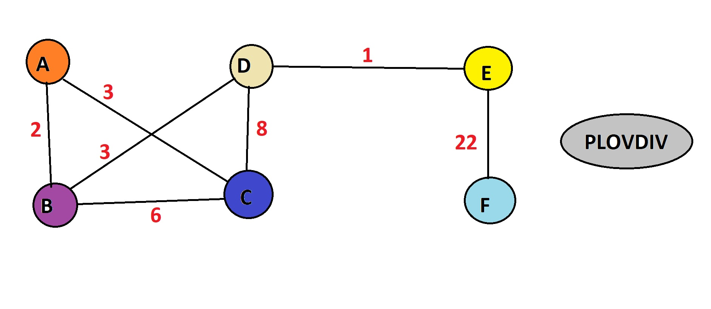

<i>You have to load this folder in java environment . 
This project has been created in Java 8. 
To open this project, please open Java program, in File menu choice Import and follow the steps to load project . 
Click run for start project! 
Enjoy!!! :)</i>

Dijkstra's algorithm is an algorithm for finding the shortest paths between nodes in a graph. 

